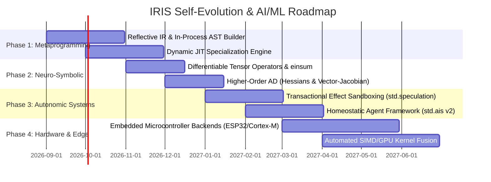

# IRIS Self-Evolving Software Architecture & AI/ML Roadmap (2026+)

> **Vision**: Transition software engineering from static, compiled-once artifacts to **living, autonomic computation substrates** that continuously optimize, self-specialize, and safely adapt under mathematically verified physical and formal invariants.

---

## 1. Executive Summary

In 2026, existing "self-modifying" or "self-evolving" systems remain brittle external wrappers: language models or optimizers invoke Python `eval()`, execute uncontrolled subshells, and rewrite source files on disk without type safety, semantic guarantees, or transactional rollbacks.

This roadmap describes **in-process, verifiable self-evolution** for IRIS. The
bounded RC contract is implemented for scalar policy functions; the remaining
roadmap generalizes that proven core to richer state and model ABIs. The
architecture unifies:
- **Algebraic Effects with Resumption** (`handle` / `resume` / `mask`)
- **Dual-Mode Automatic Differentiation** (Reverse-mode tape + forward-mode dual numbers)
- **Static Effect Verification** (`--strict-effects` proving allocation-freedom and I/O isolation)
- **Zero-Cost Ownership & Borrow Checking** (`move`, `&`, `&mut`)
- **Dual Evaluation Substrates** (Interactive tree-walking IR interpreter $\leftrightarrow$ optimized LLVM native binaries)

The goal is software that can perceive environmental drift, synthesize candidate
algorithms, verify them prior to execution, and hot-swap them online while
preserving explicit safety envelopes.

### Current implementation boundary (2026-09-01)

| Capability | Current status |
|---|---|
| Function-valued effect rows | Implemented: `|T| -> U effect E` is bound and checked at higher-order call sites under `--strict-effects`. |
| Source validation/evaluation | Implemented in the IR interpreter with execution limits and the full compiler pipeline. Standalone native binaries expose `reflect_available() == false` and return an explicit error. |
| Result-level speculation | Implemented for pure callbacks; effectful candidates are rejected in strict mode. |
| Transactional rollback | Implemented for nested list/map/atomic state and staged filesystem writes across interpreter and native/JIT execution. Multi-file filesystem commit atomicity remains an open limitation. |
| Native JIT/hot-swap | Implemented with LLVM ORC, stable ABI fingerprints, coherent whole-program gateway leases, eight-generation bounded history, exact-generation rollback, and content-addressed source artifacts. |
| Governed evolution | `iris evolve` implements seven scalar-policy gates. The library also provides v2 JSON/command/scalar program manifests, explicit JSON state contracts, and atomic multi-gateway install; generalized CLI canary metrics remain open. |
| Audit trust anchor | `iris evolve` requires and verifies an independently named persisted audit-head checkpoint; deployment must place it in a separate trust domain for adversarial rollback protection. |
| Strict AIS/ML effects | `std.ais`, `std.tensor`, `std.tensorx`, `std.nn`, and `std.ml` compile as a transitive strict-effect graph. Extern host calls require explicit effect contracts. |
| Native worker sandbox | Windows workers are staged in an ephemeral zero-capability LPAC, created suspended, attached to a memory/CPU/process-limited Job Object, supervised through bounded pipes, and token-attested in integration tests. Unsupported platforms fail closed. The scalar evolution CLI still validates candidates in the bounded interpreter. |
| Embedded targets | Allocation-free bundle generation exists for Arduino Uno/ATmega328P, Cortex-M4F/M33, and ESP32 profiles. Physical validation currently covers the documented Uno scalar/control-flow profile; Cortex-M/ESP32 hardware validation remains open. |

The RC boundary is intentional. Arbitrary source authority and unrestricted
native execution are not claimed. Stateful migration is available only
through the explicit versioned JSON snapshot/import contract.

---

## 2. The Four Pillars of Self-Evolving Software in IRIS

```
┌─────────────────────────────────────────────────────────────────────────────┐
│                          1. PERCEPTION & SENSING                            │
│         Telemetry, Invariant Monitoring, Loss Metrics, ROS 2 Topics         │
└──────────────────────────────────────┬──────────────────────────────────────┘
                                       │
                                       ▼
┌─────────────────────────────────────────────────────────────────────────────┐
│                 2. ACTIVE INFERENCE & HOMEODYNAMIC CONTROL                  │
│           Minimize Variational Free Energy, Detect Compute / Latency Drift  │
└──────────────────────────────────────┬──────────────────────────────────────┘
                                       │
                                       ▼
┌─────────────────────────────────────────────────────────────────────────────┐
│               3. NEURO-SYMBOLIC SPECULATION (EFFECT SANDBOX)                │
│       Candidate IR Synthesis, Policy Optimization in Algebraic Mask,        │
│       Formally Verified via HM Type Inference and --strict-effects          │
└──────────────────────────────────────┬──────────────────────────────────────┘
                                       │
                                       ▼
┌─────────────────────────────────────────────────────────────────────────────┐
│                 4. IN-PROCESS JIT SPECIALIZATION & HOT-SWAP                 │
│      Zero-Downtime Function Replacement with Guaranteed State Invariants    │
└─────────────────────────────────────────────────────────────────────────────┘
```

### Pillar I: Speculative Sandboxing via Algebraic Effect Handlers (`std.speculation`)
When software modifies its own behavior, the central challenge is preventing catastrophic side effects. The planned system runs candidate code inside an isolated algebraic handler that virtualizes I/O, memory, and physical actuators:
- A candidate policy that violates a safety boundary should roll back through delimited continuations without impacting physical hardware.
- Verified state changes and policy mutations should commit atomically.

### Pillar II: In-Process Verified Reflection & JIT Hot-Swapping (`std.reflect`)
The interpreter currently exposes in-process parsing, full validation, and
bounded evaluation (`reflect_eval`, `reflect_validate`). Native binaries do not
yet embed the compiler. The planned native implementation will run synthesized
code through the same type, borrow, and effect checks before activation.

### Pillar III: Unified Continuous-Discrete Neuro-Symbolic Engine
Modern AI splits continuous neural weights (PyTorch/CUDA) from discrete symbolic reasoning (Python/C++). IRIS unifies both:
- Gradients propagate through symbolic control flow (`if`, `when`, `for`), numerical integrators, and neural model architectures (`model`, `layer dense`).
- Autodiff tape handles survive function boundaries and loop back-edges with chunked arena memory reuse (<175 KB overhead per thread).

### Pillar IV: Homeostatic Self-Preservation & Active Inference (`std.ais`)
Rather than optimizing arbitrary external rewards that cause reward hacking:
- Systems self-regulate against internal homeostatic setpoints (memory ceiling, thermal budget, 1 kHz deadline compliance).
- Dynamic Bayesian belief updating continuously adapts control policies to changing sensor noise and dynamics.

---

## 3. Transformations in AI and Machine Learning

| Dimension | Traditional Python/C++ AI Stack | The IRIS Paradigm |
|---|---|---|
| **Two-Language Problem** | Python glue + C++/CUDA kernels | **Single language**: Neural definitions, systems concurrency, and hardware telemetry share one syntax and type system. |
| **Footprint & Memory** | 500 MB+ framework binaries with GC pauses | **Lightweight native binaries** (<500 KB) with <175 KB per-thread AD tape and zero GC pauses. |
| **Real-Time Edge Autonomy** | Bounded to high-compute servers | **1 kHz continuous adaptation** directly on embedded microcontrollers, drones, and edge robotics. |
| **Safety Guarantees** | Opaque black-box models | **Static effect checks** (`--strict-effects`) plus explicit interpreter step/depth limits; full real-time and termination proofs remain future work. |

---

## 4. Multi-Phase Roadmap (2026–2027)



### Milestone Schedule:
1. **Phase 1 (Q3–Q4 2026) — Metaprogramming & In-Process Reflection**
   - Safe reflection module `std.reflect` with `reflect_eval` and `reflect_validate`.
   - In-process typed IR construction and JIT hot-swapping.
2. **Phase 2 (Q4 2026) — Neuro-Symbolic Differentiable Substrate**
   - First-class tensor arithmetic with automatic broadcasting.
   - Higher-order automatic differentiation (vector-Jacobian products, Hessians).
3. **Phase 3 (Q1 2027) — Autonomic Self-Evolution & Safe Speculation**
   - Speculative effect isolation in `std.speculation`.
   - Active inference decision loops and homeodynamic controllers in `std.ais`.
4. **Phase 4 (Q2 2027) — Edge, Embodied Robotics & Kernel Fusion**
   - Microcontroller targets (ARM Cortex-M, ESP32) with allocation-free execution proofs.
   - Multi-node distributed swarm synchronization over ROS 2 DDS.
